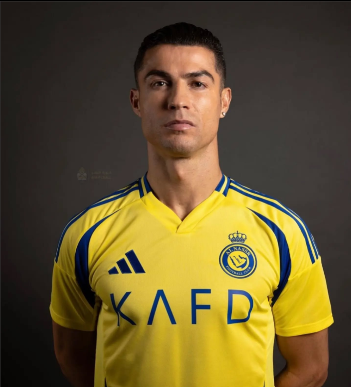

# Programación y Plataformas Web (PPW)

---

# 🧠 Práctica 1 – Explorando los Estándares Web con HTML, CSS y JavaScript

**Asignatura:** Programación y Plataformas Web  
**Unidad:** 1.2 – Estándares Web  
**Estudiante:** **John Serrano**  
**Repositorio:** [https://github.com/johnserrano09/icc-ppw-u1-miPrimeraPagina](https://github.com/johnserrano09/icc-ppw-u1-miPrimeraPagina)  
**Página desplegada (GitHub Pages):** [https://johnserrano09.github.io/icc-ppw-u1-miPrimeraPagina/](https://johnserrano09.github.io/icc-ppw-u1-miPrimeraPagina/)  

---

## 🧱 Estructura HTML utilizada

| Componente | Descripción | Implementación |
|-------------|--------------|----------------|
| `<!DOCTYPE html>` | Declaración del documento HTML5 | Línea 1 |
| `<html lang="es">` | Define el idioma del documento como español | Español |
| `<header>` | Encabezado principal del sitio | Contiene los títulos `<h1>` y `<h2>`, además de un botón para cambiar el color |
| `<section>` | Agrupa el contenido principal del documento | Tres secciones: tabla comparativa, etiquetas nuevas y conclusión |
| `<table>` | Muestra los datos de comparación entre Cristiano Ronaldo y Messi | Incluye filas con `<th>` y `<td>` |
| `<figure>` | Contiene imágenes con su pie de foto `<figcaption>` | Usado para mostrar imágenes de Ronaldo y Messi |
| `<aside>` | Contenido adicional o complementario | Describe la rivalidad entre ambos jugadores |
| `<footer>` | Pie de página | Contiene nombre del estudiante y la asignatura |
| `<script>` | Conecta el archivo JavaScript externo | Ejecuta la interacción del botón |

---

## 🧩 Nuevas etiquetas exploradas

| Etiqueta | Descripción | Implementación |
|-----------|--------------|----------------|
| `<figure>` | Contenedor para una imagen y su descripción | Usado para mostrar las imágenes de Cristiano Ronaldo y Lionel Messi con `<figcaption>` |
| `<aside>` | Define información relacionada o complementaria al contenido principal | Se usa para mostrar un texto sobre la rivalidad entre ambos futbolistas |

**Código usado:**
```html
<figure>
  
  <figcaption>Cristiano Ronaldo en su kit de Al Nassr 2024/25 (EL MEJOR).</figcaption>
</figure>

<aside>
  <p>La rivalidad entre el Bicho y Messi ha definido el fútbol moderno.</p>
</aside>
```
## Capturas de pantalla del proyecto final

